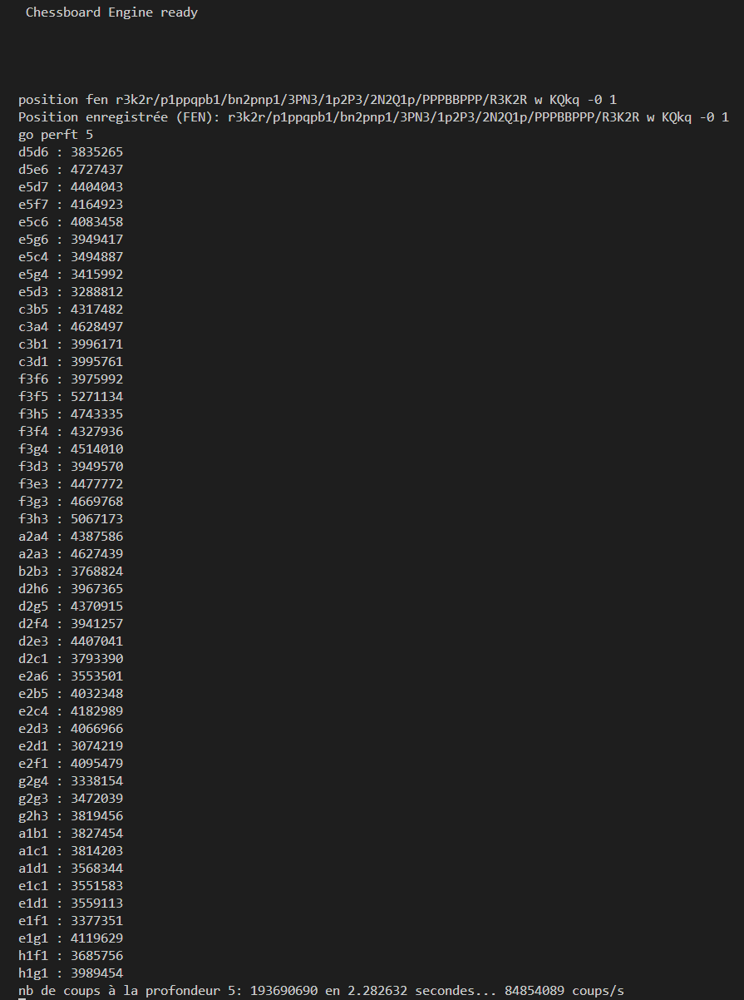
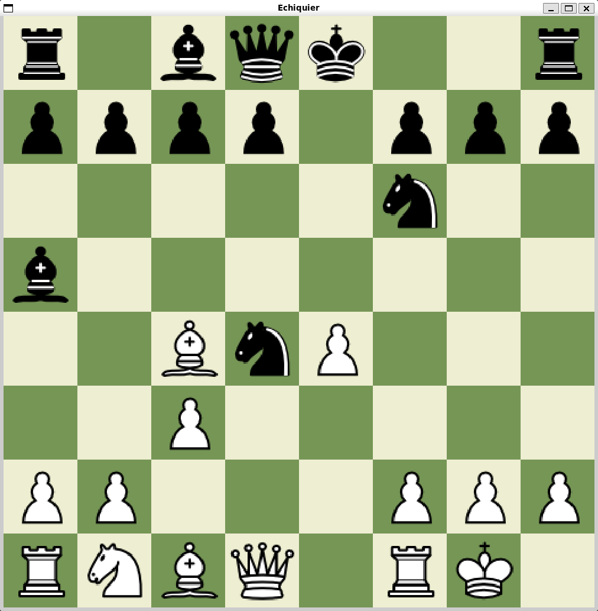

# ♟️ Chessboard Engine

A chess engine written in **C**, using **bitboards** and tested with **Criterion**.  
It can load FEN positions, generate all legal moves, and run **perft tests** to validate move generation.  

---

## 📂 Project Structure

    ├── assets/           # Resources (images, ...)
    ├── lib/
    │   └── chessboard/   # Engine headers
    ├── src/
    │   └── chessboard/   # Engine source code
    ├── tests/            # Unit tests (Criterion)
    ├── Makefile          # Build system
    └── README.md         # This file

---

## ⚡ Installation & Build

### Requirements
- **gcc** or **clang**
- **make**
- **Criterion** for tests  
```sh
  sudo apt-get install libcriterion-dev
```


### Build with GUI
```sh
  make ui
```
  

### Run the engine
```sh
  make run
```

### Run tests
```sh
  make test
```

## Features

- Load positions via FEN ✅

- Generate all legal moves ✅

- Play a game through a GUI ✅

- Validate move generation using perft tests ✅

- Position evaluation (WIP)

- Search engine (minimax / alpha-beta, WIP)

### 🧪 CI/CD

This project is automatically tested with GitHub Actions.
Unit tests are executed on every push and pull request.

Move generation is validated using perft tests.
👉 [Perft results reference](https://www.chessprogramming.org/Perft_Results)

## 🚀 Optimizations

To improve performance and speed up perft tests, several optimizations have been implemented:

- Bitboards: 64-bit masks to represent the board, enabling fast operations with bitwise logic.

- Precomputed tables: cached attacks for "normal" pieces (knight, pawn, king) and magic bitboards for sliding pieces (rook, bishop, queen).

- Multi-threaded perft: parallelized tree exploration to take advantage of multi-core CPUs.

- Reduced dynamic allocations: use of preallocated arrays (Move move_list[MAX_MOVES]) to avoid unnecessary memory overhead.

### ⚡ Performance:

Single-thread speed: 8–10 million moves/s

Multi-thread speed: 40–90 million moves/s
(⚠️ Multi-threading is less efficient when the root position has fewer legal moves)

## Future Work

Planned improvements and features to make the engine stronger and more complete:

#### Search improvements

- Implement iterative deepening

- Add alpha-beta pruning

- Introduce move ordering (killer moves, history heuristic)

#### Position evaluation

- Material and piece-square tables

- King safety and pawn structure evaluation

- Mobility and control of the center

#### Transposition tables

- Store already-evaluated positions using Zobrist hashing

- Reduce redundant calculations in search

#### UCI Protocol support

- Allow communication with GUIs such as Arena, Cute Chess, or lichess-bot


---

## 📸 Screenshots

### 🧵 Multi-threaded Perft Test
Exemple d’un perft test lancé en multi-threading :  


### 🎨 Graphical User Interface
Interface graphique permettant de jouer une partie :  

